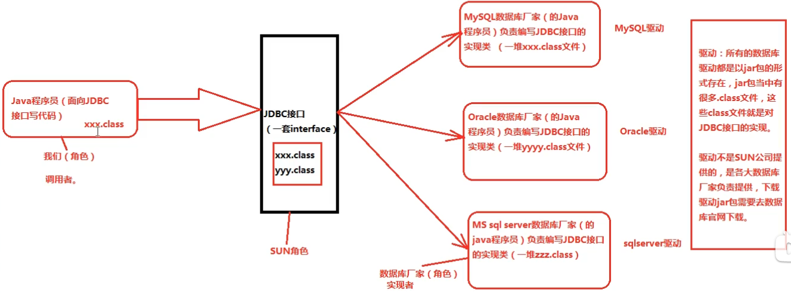

JDBC： Java Database Connectivity

JDBC的本质：是SUN公司制定的一套接口（interface）。实现面向接口编程。（解耦合：降低程序的耦合度，提高程序的扩展力。）

JDBC 使用图解：



JDBC编程六步：

 	1. 注册驱动（作用：告诉Java程序，即将要连接的是哪个品牌的数据库）
 	2. 获取连接（表示JVM的进程和数据库进程之间的通道打开了，属于进程之间的通信，使用完之后，一定记得关闭）
 	3. 获取数据库操作对象（专门执行sql语句的对象）
 	4. 执行sql语句
 	5. 处理查询结果集（只有当第四步执行的是select语句，才有第五步的处理查询结果集）
 	6. 释放资源（Java和数据库之间属于进程间的通信，开启之后一定记得关闭。）

JDBC事务控制的应用

​	如何解决事务自动提交所产生的问题：

```java
1.在 第二步获取连接 后面，将自动提交关闭：
Connection connection = DriverManager.getConnection(url, user, password);
connection.setAutoCommit(false);
2.在程序的 第四步或者第五步后面 手动提交；
connection.commit();
3.在释放资源之前（finally语句中）做事务回滚。
connection.rollback();
```

JDBC的乐观锁和悲观锁

sql语句后面加上 for update; 称为行级锁，也称为悲观锁。

悲观锁事务必须排队执行。而乐观锁支持并发。只需要一个版本号。

```mysql
select * from emp for update;
```

